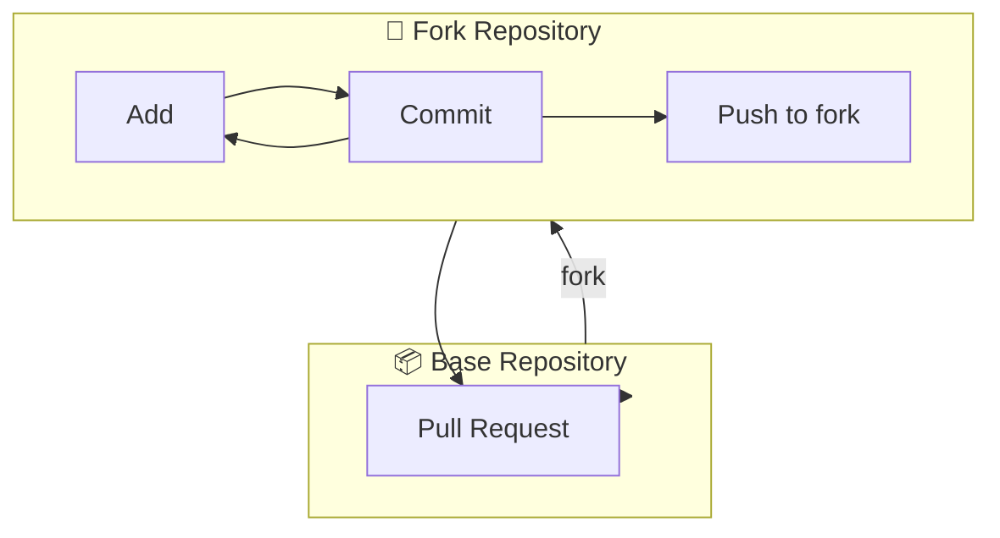

# CS PD Week GitHub Workshop Notes



| Command | Description |
|---------|-------------|
| `git clone` | Creates a local copy of a remote repository |
| `git add` | Adds files to be included in the next commit |
| `git commit` | Creates a snapshot of changes with a message |
| `git push` | Sends commits to the remote repository |
| `git pull` | Fetches and integrates changes from the remote repository |

- This is a bullet
- This is another bullet
- And a third button

1. Numbered list
2. Two
3. Three

**Bold** and _italics_ text, or **_both_**!

You can also have `inline code` formatting.

## What on earth is happening?
No one knows.

Sponsored by [CSTA](https://csteachers.org)

```javascript
function helloWorld() {
  console.log('Hello, world');
}
```
